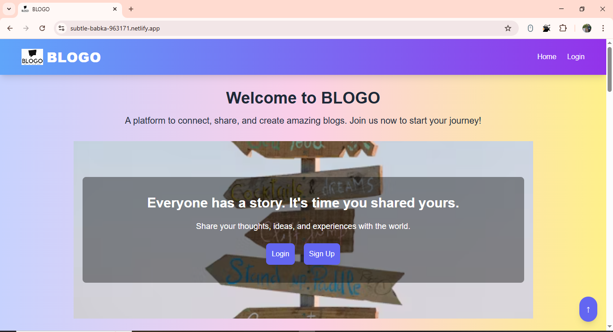
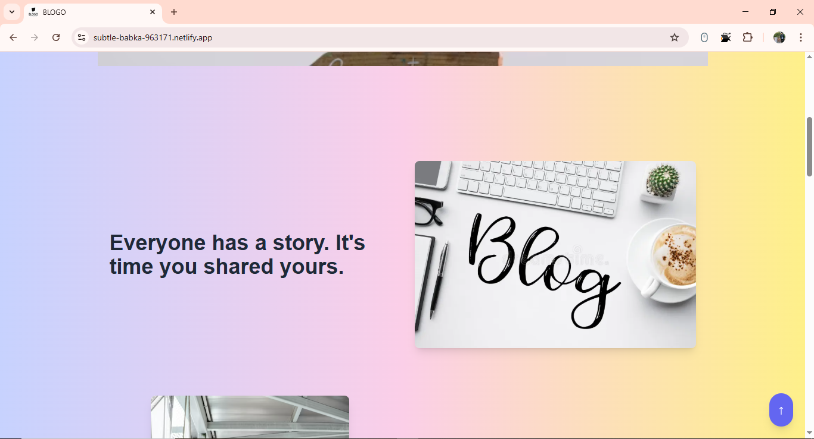
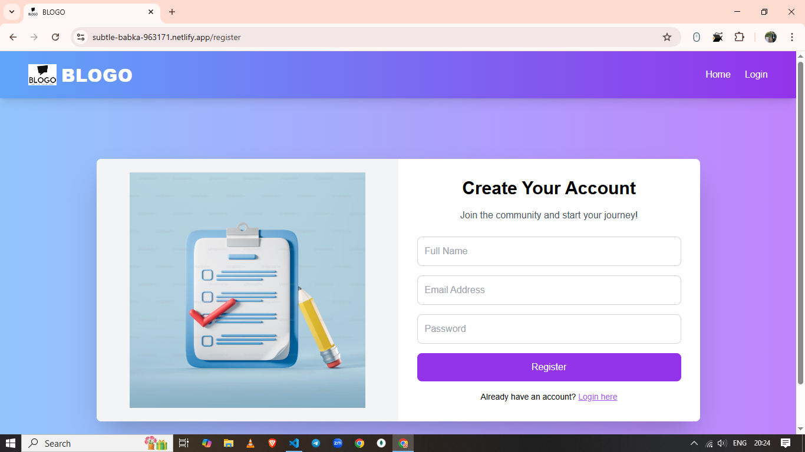
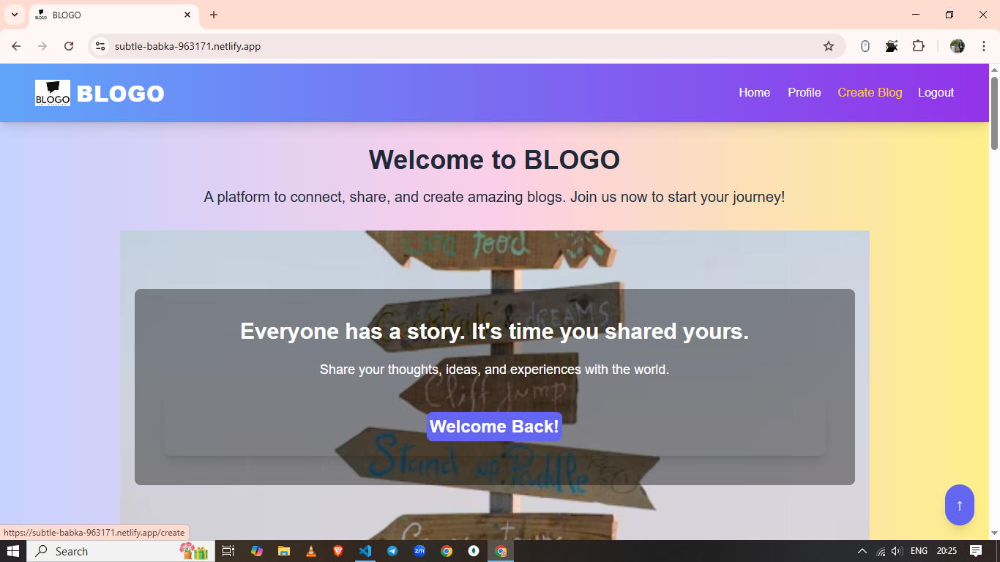
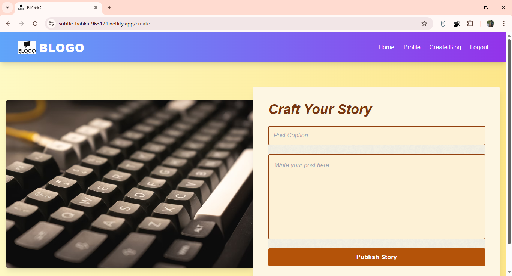
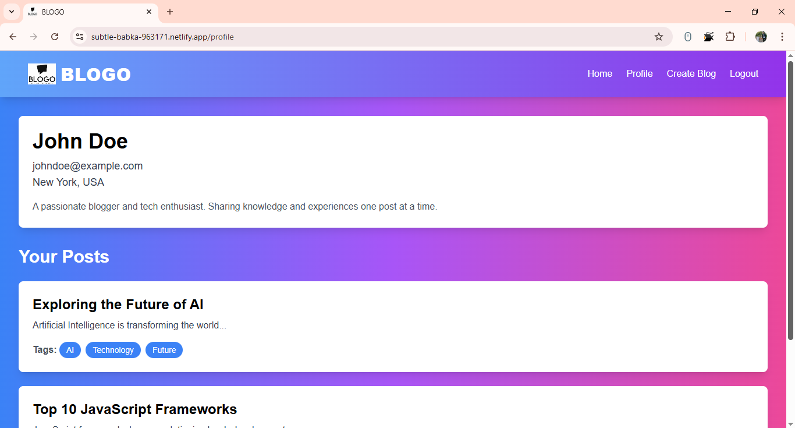

# 📝 BLOGO

A full-stack blog platform where users can register, log in, create posts, view posts, and interact with other users' posts.

---

## 🌐 Deployment Links

- **Frontend**: [https://subtle-babka-963171.netlify.app/](https://subtle-babka-963171.netlify.app/)
- **Backend**: [https://blog-platform-osks.onrender.com/](https://blog-platform-osks.onrender.com/)

---

## 📸 Screenshots

### Landing Page (Section 1)


### Landing Page (Section 2)


### Login Page


### Register Page


### After Login (Home Page)


### Create Blog Page


### Profile Page


---

## ✅ Features

- User authentication (Register/Login).
- Create, view, and delete blog posts.
- Add comments to blog posts.
- View user profiles and their posts.

---

## 🚀 How to Run Locally

1. Clone the repository:
   ```bash
   git clone https://github.com/your-repo/blog-platform.git
   cd blog-platform
   ```

2. Install dependencies for both client and server:
   ```bash
   cd client
   npm install
   cd ../server
   npm install
   ```

3. Start the development servers:
   - **Frontend**:
     ```bash
     cd client
     npm start
     ```
   - **Backend**:
     ```bash
     cd server
     npm start
     ```

4. Open your browser and navigate to `http://localhost:3000`.

---

## 📜 API Endpoints

### 1. `POST /api/auth/register`
👉 **Register a new user**

### 2. `POST /api/auth/login`
👉 **Login and get Token**

### 3. `GET /api/auth/me`
👉 **Get logged-in user details**

### 4. `POST /api/posts/create`
👉 **Create a new post**

### 5. `GET /api/posts/user/:id`
👉 **Get all posts by a specific user**

### 6. `GET /api/posts/`
👉 **Get all posts from all users**

### 7. `PATCH /api/posts/update`
👉 **Update a post caption or image**

### 8. `DELETE /api/posts/delete/:id`
👉 **Delete a post**

### 9. `PATCH /api/posts/comment`
👉 **Add a comment to a post**

---

## 🛠️ Tech Stack

- **Frontend**: React, TailwindCSS
- **Backend**: Node.js, Express.js
- **Database**: MongoDB
- **Authentication**: JWT (JSON Web Tokens)

---

## 📧 Contact

For any queries, feel free to reach out at [sandeepkumar29774@yahoo.com](sandeepkumar29774@yahoo.com).

